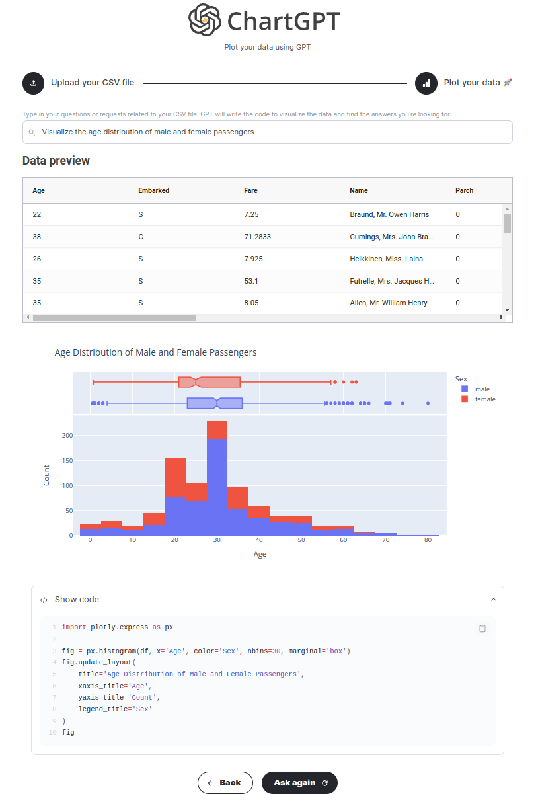
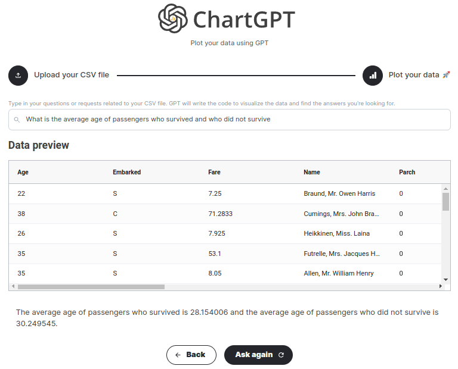

# chat-data-vis

LLM-based visual data analysis

## 运行

1. 创建虚拟环境

```shell
conda create -n chat-data-vis python=3.9
conda activate chat-data-vis
```

2. 安装依赖包

```shell
pip install -r requirements.txt
```

3. 配置 LLM 环境变量

例如 zsh，则在 .zshrc 中配置

使用不同的 API 提供商，需要配置的变量可能存在差异

```shell
export OPENAI_API_KEY="sk-xxx"
export OPENAI_API_BASE="https://xxx.com/v1"
export OPENAI_ORGANIZATION_ID="org-xxx"
```

4. 启动项目

```
python app.py
```

在网页中访问 http://127.0.0.1:8050/

示例数据见 data 目录

示例问题

- Visualize the age distribution of male and female passengers
- What is the average age of passengers who survived and who did not survive

结果




